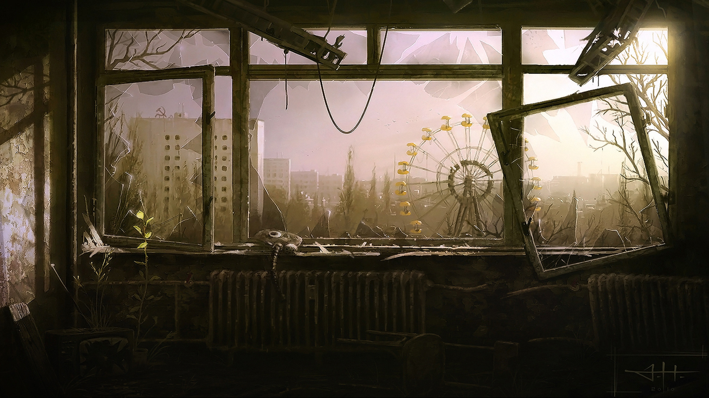
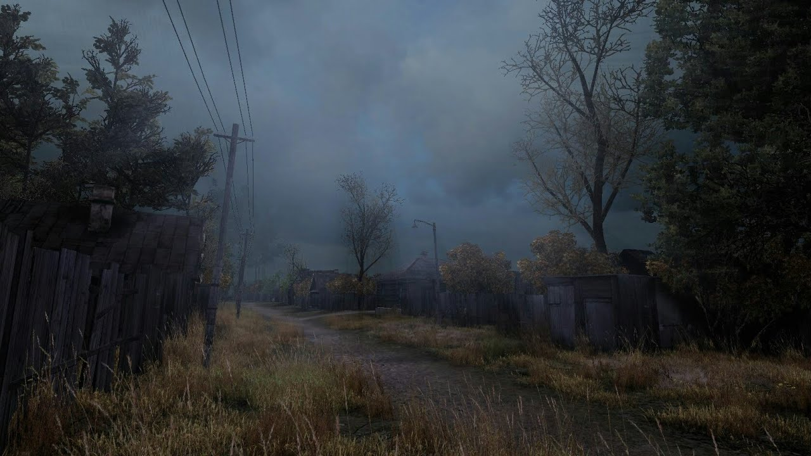
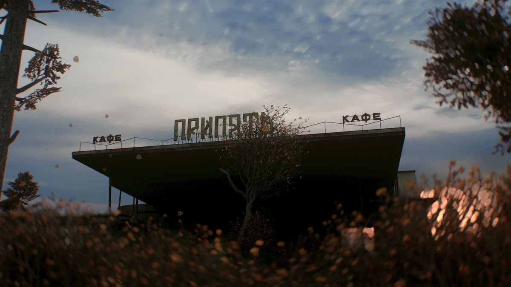

<p align="center">
  
</p>

<h1 align="center">☢️ Shard of the Exclusion Zone ☢️</h1>

---

## 📖 О проекте

**Shard of the Exclusion Zone** — фанатский проект, вдохновлённый серией игр **S.T.A.L.K.E.R.**.  
Цель — передать атмосферу Зоны через интерфейс, музыку и визуальный стиль.

Здесь есть динамический фон, сталкерские саундтреки, меню в стиле «Зоны» и элементы, которые позволяют прочувствовать дух постапокалиптического мира.

---

## 🖼️ Демо / Скриншоты

<p align="center">
  
  
</p>

---

## 🚀 Как запустить

```bash
git clone https://github.com/zentryx200/shard-of-the-exclusion-zone.git
cd shard-of-the-exclusion-zone
pnpm install
pnpm dev
```
